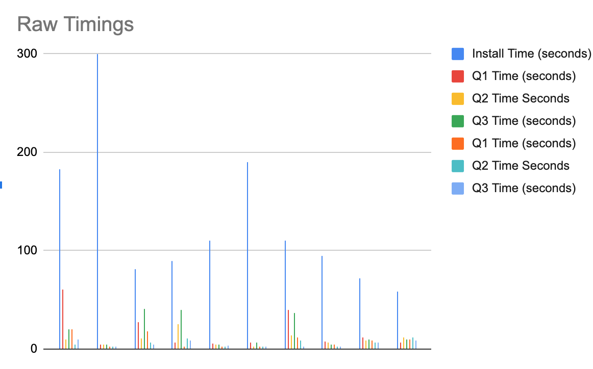
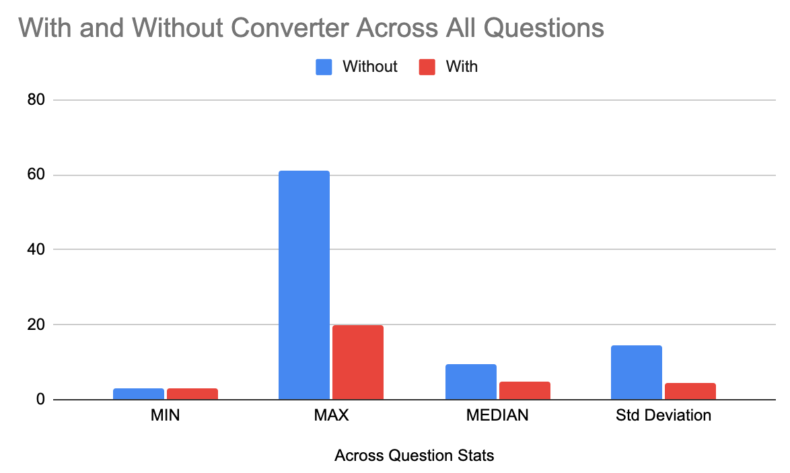

# Experiment Conclusions

Our data and visualizations can be seen at this [Google Sheet](https://docs.google.com/spreadsheets/d/1ELbdBy0VkcmrFD7b4gYCQ_V5RlJtX6giR6ps5TzmwQY/edit#gid=0). Some visualizations and summaries are provided inline below.

## Methods

We studied 10 different participants who went about testing our unit converter extension. Each particpant had 60 minutes to calculate certain values with and without the help of the unit converter extension. We assigned each particpant 2 Google forms [Form1](https://docs.google.com/forms/d/e/1FAIpQLSdFFbaXtMoxbzXF057jp3BFg0NaoRiNNid-qNR28nhi2NzZSw/viewform) and [Form2](https://docs.google.com/forms/d/e/1FAIpQLSdWDTLWTeiQgacUpCE_Qu_oP_zpBM_aOjExY3HrF3yvlkBdTA/viewform) and got them to fill theese forms up without and with the help of the unit converter extension respectively. We observered their progress via Zoom screen sessions. 

Our participants had to download the repository, and enable the extension as shown in [README.md](https://github.com/harshkachhadia/units_converter_extension)

## Materials

The participant had to download our repository to conduct our experiment. We used this method for each participant. 

We utilized [Google form 1](https://docs.google.com/forms/d/e/1FAIpQLSdFFbaXtMoxbzXF057jp3BFg0NaoRiNNid-qNR28nhi2NzZSw/viewform) and [Google form 2](https://docs.google.com/forms/d/e/1FAIpQLSdWDTLWTeiQgacUpCE_Qu_oP_zpBM_aOjExY3HrF3yvlkBdTA/viewform) for capturing user feedback. 
The following responses were taken in Form1:

* Token Number?
* Conversion of km in miles? 
* Conversion of days in seconds?
* Conversion of Fahrenhiet to Celcius? 
 
The following responses were taken in Form2:

* Token Number?
* Conversion of km in miles? 
* Conversion of days in seconds?
* Conversion of Fahrenhiet to Celcius? 
* On a scale from 1 to 5 (1 being easiest and 5 being hardest), how easy was the extension to install? 
* On a scale from 1 to 5 (1 being easiest and 5 being hardest), how easy was the extension to use for conversion?
* Do you plan to use this extension in the future? 

## Observations

1. From the graph we see that the installation time is considerably higher when compared to the time required to solve the questions.
2. From the graph we see that there is no major difference in the minimum time required to solve the questions while using the unit converter extension.
3. From the graph we see that the maximum time required to solve the questions has been reduced by two-thirds whileusing the unit converter extension.
4. From the graph we see that the median time required to solve the questions has also been reduced by around half while using the unit converter extension.
5. From the graph we see that the standard derivation time required to solve the questions has been reduced by two-thirds while using the unit converter extension.

## Conclusions

1. The maximum time spent in this project is during the installation.
2. The unit converter extension is not very helpful in reducing the minimum time required to solve the questions.
3. The unit converter extension is quite helpful in bringing down the maximum time required to solve the questions.
4. The unit converter extension is quite helpful in solving the questions easily once the installation is done.
5. The unit converter extension is quite helpful in significantly reducing the standard deviation of a group therby saving a lot of time.

## Threats to Validity

Our threats to validity can be summarized in a few key points

* We did not time the time required to solve a question very precisely. 

Since the duration required by a participant to solve a question using the unit converter was very less we might have missed to report the accurate time to solve a question. This could  skew our results in the form of either bias, or simply forgetfullness. 

* Our sample size is small.

10 participants is very small for an experiment to draw meaningful conclusions from. 

## Learnings

We had a handful of learnings from conducting this experiment

